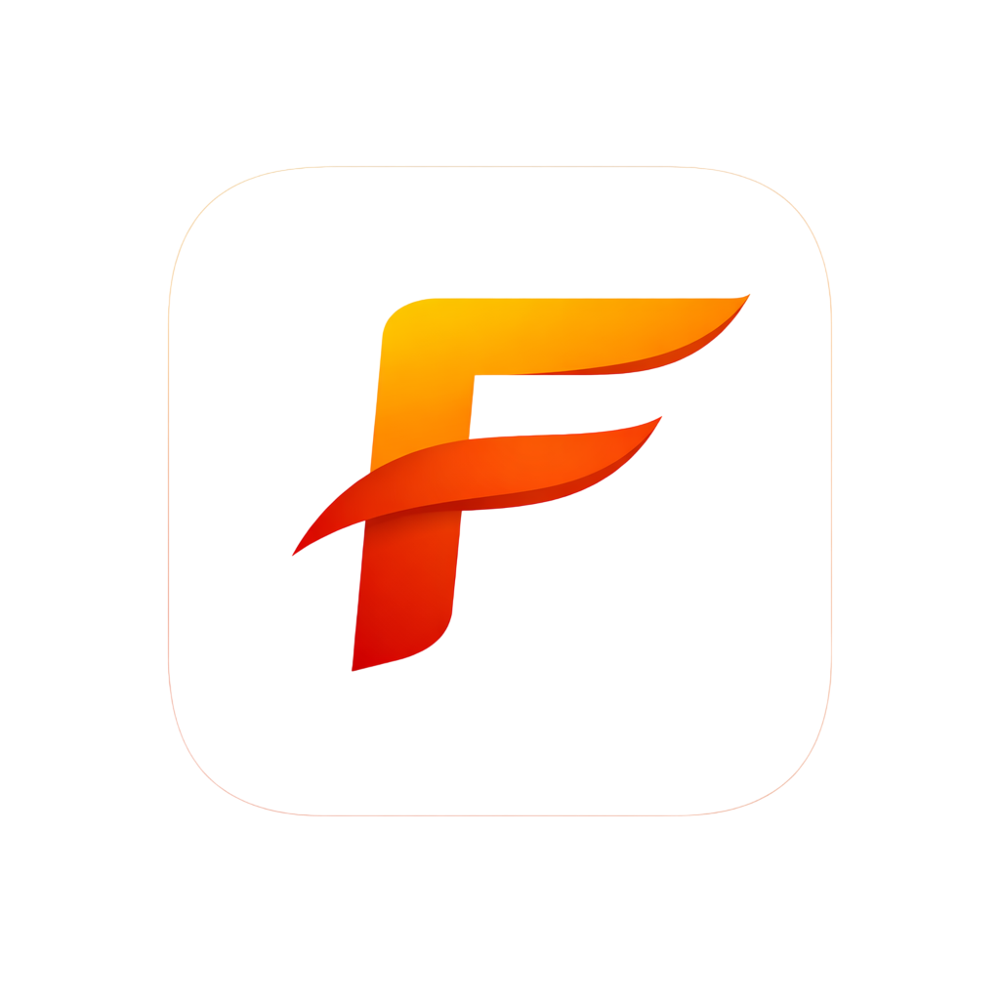
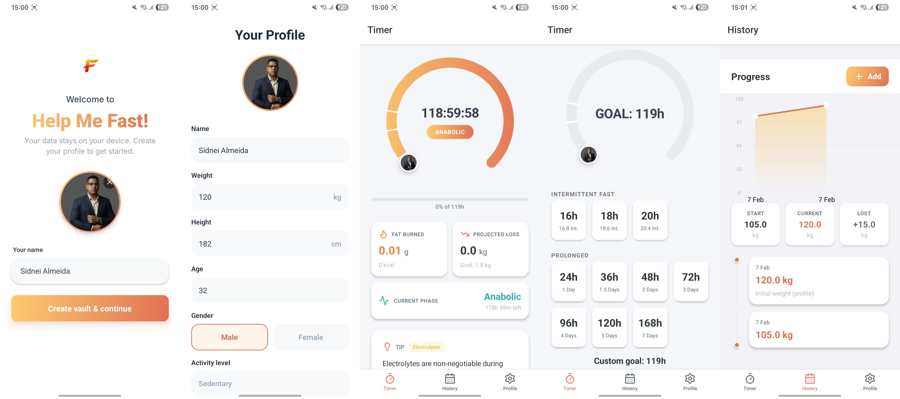

#  Help Me Fast (Android)

   

> **Prolonged fasting companion for Android** — metabolic timer, progress tracking, and neuroscience-based pattern interruption. Data stays on device (local-first).

**[Download APK](https://github.com/sidnei-almeida/help_me_fast_android/releases)** (latest release) — install on your Android device without building from source.

The mobile counterpart to the [Help Me Fast](https://github.com/sidnei-almeida/help_me_fast) desktop app (Electron/Linux). Same design language and feature set, adapted for touch and small screens. No cloud, no account; config, profile, and history are stored locally on the device.



*App screens on device (Timer, Progress, Profile).*

---

## Overview

Help Me Fast (Android) is not a simple countdown. It combines:

- **Metabolic-phase awareness** — A visual arc (gradient wheel) that reflects biological phases (anabolic, catabolic, fat burning, ketosis) and a countdown to your goal.
- **Data-driven motivation** — Real-time estimates of fat burned and projected weight change from your profile (BMR/TDEE).
- **Pattern interruption** — A dedicated “I’m hungry” flow that prompts you to distinguish real hunger from boredom or habit before breaking a fast.
- **Local-first storage** — All config, profile, and history live on the device (AsyncStorage + file system for photos). No cloud, no account.

The UI mirrors the desktop app: bottom tabs (Timer, Progress, Profile), central metabolic wheel, and the same gradient and typography. Built with Expo (SDK 54) and React Native.

---

## Features

- **Timer** — Countdown from your chosen fast length (presets and custom hours via slider). Persists across app restarts via absolute timestamps.
- **Metabolic wheel** — Single continuous gradient (gold to orange) that “empties” as time elapses; phase dividers and optional profile avatar; tap for current phase and tips.
- **Dashboard (Timer screen)** — While fasting: fat burned, projected weight loss, current phase card. Rotating tips (electrolytes, hydration, safety). When idle: duration presets, custom hours slider, and “Start Fast”.
- **Pattern-interruption modal** — “I’m hungry / I’ll eat” opens a modal: “Real hunger or boredom/habit?” to encourage a deliberate choice before ending the fast.
- **Profile** — Name, avatar, weight, height, age, gender, activity level. BMR/TDEE used for projections. Profile screen allows editing; optional “Disconnect vault” resets app state.
- **Progress (History)** — Entries with date, optional weight, optional photo, notes. Weight chart (react-native-gifted-charts). Stats row (Start / Current / Lost). Add entries via modal; photos stored in app document directory.
- **Vault / onboarding** — First run: set name and avatar, then complete profile. All data is stored locally (AsyncStorage + `documentDirectory` for photos).

---

## Tech Stack

| Layer        | Choice |
|-------------|--------|
| Runtime     | Expo SDK 54, React Native 0.81 |
| Language    | TypeScript (strict) |
| UI          | React 19 (functional components, hooks) |
| Navigation  | React Navigation 7 (bottom tabs, native stack) |
| State       | React Context + useReducer (single store) |
| Charts      | react-native-gifted-charts |
| Icons       | lucide-react-native |
| Persistence | AsyncStorage; expo-file-system for photos |
| Build       | EAS Build (Expo Application Services) or local Gradle |

---

## Requirements

- **Node.js** 18+ (20 LTS recommended)
- **npm** (or compatible package manager)
- **Android**: for running on device or emulator — Android Studio (SDK, emulator), or Expo Go for quick testing
- **EAS Build** (optional): Expo account for cloud builds; see [expo.dev](https://expo.dev)

---

## Installation

### Cloning the repository

This repo uses [Git LFS](https://git-lfs.com/) for large files (e.g. `*.apk`, `*.AppImage`). After cloning, pull LFS objects so you get real files instead of pointers:

```bash
git clone https://github.com/sidnei-almeida/help_me_fast_android.git
cd help_me_fast_android
git lfs pull
cd app
npm install
```

If you don’t have Git LFS yet: `git lfs install` (one-time), then `git lfs pull`.

### Running in development

**Start the Metro bundler:**

```bash
cd app
npm start
```

Then:

- **Android emulator:** press `a` in the terminal, or run `npm run android` (requires `ANDROID_HOME` and `JAVA_HOME`; see `app/ANDROID_SETUP.md`).
- **Physical device with Expo Go:** install [Expo Go](https://play.google.com/store/apps/details?id=host.exp.exponent) from the Play Store, ensure the device is on the same Wi‑Fi as your machine, and scan the QR code shown in the terminal.
- **Physical device with dev build:** open `app/android` in Android Studio, run the app (▶). Keep Metro running (`npm start`) in another terminal. For “Could not connect to development server”, run `adb reverse tcp:8081 tcp:8081` once, or use `npm run start:device`.

### Building for production (APK)

The recommended way to produce an APK is [EAS Build](https://docs.expo.dev/build/introduction/):

```bash
cd app
npm run build:android
```

On first run, EAS will prompt for an Expo account (create one at [expo.dev](https://expo.dev) if needed). The build runs on Expo’s servers; you download the APK when it finishes.

- **Production profile (default):** `npm run build:android` — APK for distribution.
- **Preview profile:** `npm run build:android:preview` — APK for internal testing.

For a fully local build without an Expo account, use a development build and Android Studio (Gradle); see `app/ANDROID_SETUP.md` for SDK and environment setup.

**Pre-built APK:** Download the latest APK from the [Releases](https://github.com/sidnei-almeida/help_me_fast_android/releases) page and install on your Android device.

---

## Development

```bash
cd app
npm start
```

Then press `a` for Android (with emulator and env configured), or scan the QR code with Expo Go.

- **Run on Android (native):** `npm run android` or `npm run run:android` (script in `package.json` may set `ANDROID_HOME`/`JAVA_HOME` if unset).
- **Launcher icon:** The app icon is defined in `app.json` (`icon`, `android.adaptiveIcon`). After changing `app/assets/icon.png` or `adaptive-icon.png`, regenerate the native project: `npx expo prebuild --platform android --clean`. See `app/ANDROID_SETUP.md`.

---

## Project structure

```
help_me_fast_android/
├── app/
│   ├── App.tsx              # Root: fonts, boot, LoadingScreen → RootNavigator
│   ├── app.json             # Expo config (name, icon, splash, android/ios)
│   ├── assets/              # icon.png, adaptive-icon.png, logo.png, favicon
│   ├── src/
│   │   ├── components/      # LoadingScreen, MetabolicWheel, FastTypeSelector,
│   │   │                   # PanicButton, AddHistoryModal, GradientView
│   │   ├── context/        # AppContext (vault, profile, config, history, fast goal)
│   │   ├── data/           # fastingTips.ts (categories, rotation)
│   │   ├── hooks/          # useFastingTimer, useHistoryStorage, useMetabolicMotivation, useVault
│   │   ├── navigation/     # RootNavigator (tabs: Timer, Progress, Profile)
│   │   ├── screens/        # TimerScreen, HistoryScreen, ProfileScreen,
│   │   │                   # VaultSetupScreen, ProfileSetupScreen
│   │   ├── services/       # vaultStorage (AsyncStorage + file system)
│   │   ├── styles/         # theme.ts (colors, gradients, spacing)
│   │   ├── types/          # Config, Profile, HistoryEntry, FastGoal, etc.
│   │   └── utils/          # calculateTMB, weightConverter, metabolicPhases,
│   │                       # activityMultipliers, fastTypes
│   ├── android/            # Native Android project (from expo prebuild)
│   ├── package.json
│   ├── ANDROID_SETUP.md     # SDK path, USB debugging, launcher icon
│   └── eas.json             # EAS Build profiles (production, preview)
└── README.md
```

---

## Author

**Sidnei Almeida**

- GitHub: [@sidnei-almeida](https://github.com/sidnei-almeida)
- LinkedIn: [Sidnei Almeida](https://www.linkedin.com/in/saaelmeida93/)

---

## License

MIT.
